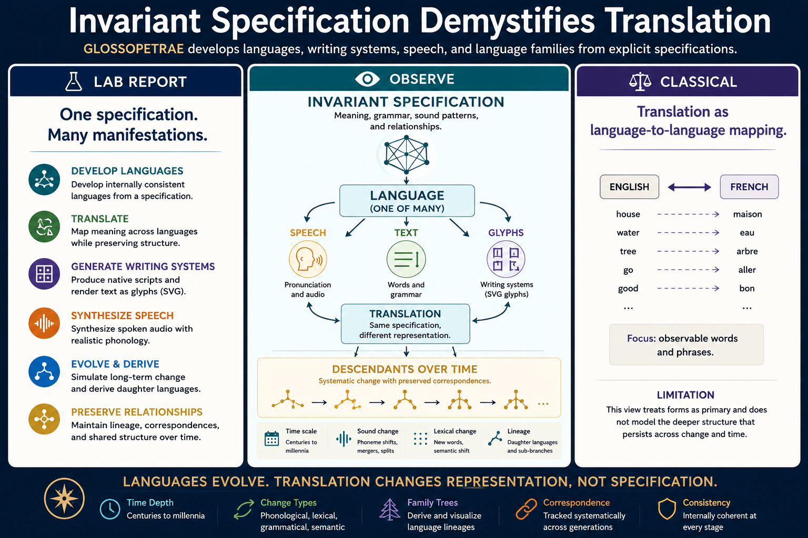

# GLOSSOPETRAE-SPEC

Investigating invariant specifications across translation, writing systems, speech, and language evolution.

<p align="center">
  
</p>

## Core Question

Languages change.

Translations differ.

Writing systems vary.

Descendant languages evolve across centuries.

What survives these transformations?

This repository explores the hypothesis that observable language forms change while deeper correspondence relations persist.

The central question is:

> What invariant structure survives translation, script change, and language evolution?

---

## Engineering Statement

> Languages evolve.
>
> Representations change.
>
> Correspondence persists.
>
> Scientific explanations should identify what survives transformation.

---

## Questions

* What constitutes a linguistic specification?
* What remains invariant under translation?
* How do writing systems preserve specification?
* How do descendant languages preserve correspondence?
* Which invariant best explains all transformations?

---

## Notebook Roadmap

| Notebook | Focus                               | Colab                                                                                                                                       |
| -------- | ----------------------------------- | ------------------------------------------------------------------------------------------------------------------------------------------- |
| 00       | Context and system overview         | <a href="https://colab.research.google.com/github/thinkthoughts/glossopetrae-spec/blob/main/notebooks/00_context.ipynb">📓</a>              |
| 07       | What is specified?                  | <a href="https://colab.research.google.com/github/thinkthoughts/glossopetrae-spec/blob/main/notebooks/07_specifications.ipynb">📓</a>       |
| 13       | What survives translation?          | <a href="https://colab.research.google.com/github/thinkthoughts/glossopetrae-spec/blob/main/notebooks/13_translation.ipynb">📓</a>          |
| 17       | What survives script change?        | <a href="https://colab.research.google.com/github/thinkthoughts/glossopetrae-spec/blob/main/notebooks/17_writing_systems.ipynb">📓</a>      |
| 23       | What survives language evolution?   | <a href="https://colab.research.google.com/github/thinkthoughts/glossopetrae-spec/blob/main/notebooks/23_descendant_languages.ipynb">📓</a> |
| 29       | What survives every transformation? | <a href="https://colab.research.google.com/github/thinkthoughts/glossopetrae-spec/blob/main/notebooks/29_invariants.ipynb">📓</a>           |

---

## Repository Progression

```text
00 Context

07 Specifications

13 Translation
      ↓
17 Writing Systems
      ↓
23 Descendant Languages
      ↓
29 Invariants
```

Each notebook applies a stronger transformation:

```text
Translation
      ↓
Script Change
      ↓
Language Evolution
```

and asks:

> What survives?

---

## Working Hypothesis

```text
Specification
      ↓
Language
      ↓
Translation
Script Change
Evolution
      ↓
Correspondence
```

Words change.

Scripts change.

Pronunciations change.

Descendant languages diverge.

Yet correspondence relationships may persist across all transformations.

---

## Repository Conclusion

The strongest invariant candidates are:

* specification
* correspondence
* lineage (for descendant languages)

The notebooks suggest that translation, writing systems, and language evolution are best understood not through identical forms, but through preserved relationships among changing forms.

The goal of this repository is to make those relationships explicit and computationally inspectable.
